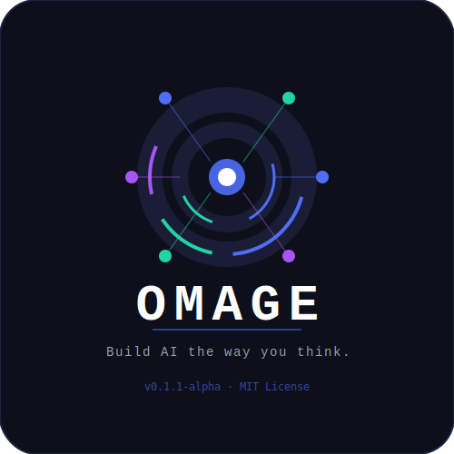

<div align="center">



# Omage

**Build AI the way you think.**

[](https://github.com/your-username/omage/releases)
[](https://python.org)
[](https://pytorch.org)
[](LICENSE)
[](tests/)
[]()

Omage is a Python library that makes building, training, and deploying AI models as simple and readable as possible — no boilerplate, no confusion.

## 🎯 About This Project

At first I'm not an AI researcher or a professional in the machine learning field. However, I was often frustrated by how complex and verbose building models with PyTorch could be for beginners and rapid prototyping.

So, with the help of Claude and Grok (xAI), I created **Omage** — a simple, readable, and high-level wrapper that lets you build, train, and experiment with AI models the way you think, with minimal boilerplate.

My goal is to help more people (especially those who are not deep into ML) to quickly test their ideas and lower the barrier of entry.

The project is still in **Alpha (v0.1.1)** and has a lot of room for improvement. Any feedback, issues, or contributions are highly welcome!

[**Quick Start**](#-quick-start) · [**Installation**](#-installation) · [**Examples**](#-examples) · [**Model Zoo**](#-model-zoo) · [**CLI**](#-cli) · [**Contributing**](#-contributing)

</div>

---

## ✨ Why Omage?

```python
# Other libraries
model = nn.Sequential(
    nn.Linear(128, 64),
    nn.ReLU(),
    nn.Dropout(0.2),
    nn.Linear(64, 10)
)
optimizer = optim.Adam(model.parameters(), lr=0.001)
criterion = nn.CrossEntropyLoss()
# ... 30 more lines of training loop

# Omage
ai = og.model(
    type="classifier",
    layers=[og.dense(128), og.dropout(0.2), og.dense(10)],
    optimizer=og.adam(lr=0.001),
    loss=og.cross_entropy(),
)
ai.train(data, epochs=10)
```

---

## 📦 Installation

```bash
# Basic
pip install git+https://github.com/Omage-Python-Library/Omage.git

# With vision models (ResNet, MobileNet)
pip install "git+https://github.com/Omage-Python-Library/Omage.git#egg=omage[vision]"

# With NLP models (GPT-2, BERT)
pip install "git+https://github.com/Omage-Python-Library/Omage.git#egg=omage[nlp]"

# Everything
pip install "git+https://github.com/Omage-Python-Library/Omage.git#egg=omage[full]"
```

> **Requirements:** Python 3.8+ · PyTorch 2.0+ · NumPy · Pandas · tqdm

---

## 🚀 Quick Start

```python
import omage as og

# 1 — Load data
data = og.load("dataset.csv")
data.set_target("label").clean().normalize().shuffle().split(0.8)

# 2 — Build model
ai = og.model(
    type="classifier",
    layers=[
        og.dense(128),
        og.dropout(0.2),
        og.dense(64),
        og.dense(10, activation="softmax"),
    ],
    optimizer=og.adam(lr=0.001),
    loss=og.cross_entropy(),
)

# 3 — Train
ai.train(data, epochs=20, early_stopping_patience=5)

# 4 — Evaluate
ai.evaluate(data)

# 5 — Predict
result = ai.predict([1.2, 0.5, 3.1, 0.8])

# 6 — Save
ai.save("my_model.omg")
```

---

## 📚 Examples

### Image Classification with ResNet

```python
import omage as og

model = og.load_model("resnet-18", num_classes=10, pretrained=True)
data  = og.load("my_images/")
og.polish(model, data, epochs=5)
```

### Text Generation with GPT-2

```python
import omage as og

model  = og.load_model("gpt2")
result = model.predict("Once upon a time")
print(result)
```

### Hyperparameter Search

```python
import omage as og

result = og.seek(model, data, epochs=3, param_grid={
    "lr":         [0.1, 0.01, 0.001],
    "batch_size": [16, 32, 64],
})
print(result["best_config"])
```

### Evolutionary Training

```python
import omage as og

og.grow(model, data, generations=10, survival_rate=0.2)
```

### Multi-Model Pipeline

```python
import omage as og

detector   = og.load_model("yolov8n")
classifier = og.load_model("resnet-50")
og.flow([detector, classifier], data)
```

### Event Callbacks

```python
import omage as og

ai = og.model(type="classifier", layers=[og.dense(128), og.dense(10)])
ai.on("onTrain",  lambda: print("Training started!"))
ai.on("onFinish", lambda: print("Done!"))
ai.on("onError",  lambda: print("Error!"))
ai.train(data, epochs=10)
```

---

## 🦁 Model Zoo

```python
import omage as og

og.list_models()
model = og.load_model("bert-base")
```

| Name | Type | Backend | Description |
|------|------|---------|-------------|
| `resnet-18` | classifier | torchvision | Lightweight image classifier |
| `resnet-50` | classifier | torchvision | Accurate image classifier |
| `mobilenet-v3` | classifier | torchvision | Fast mobile-friendly classifier |
| `gpt2` | generator | transformers | Text generation |
| `bert-base` | classifier | transformers | Text classification / embeddings |
| `distilbert` | classifier | transformers | Fast lightweight BERT |
| `yolov8n` | detector | ultralytics | Fastest object detector |
| `yolov8s` | detector | ultralytics | Balanced object detector |

---

## 🔄 AI Loops

| Loop | Description | Example |
|------|-------------|---------|
| `polish` | Fine-tune a trained model | `og.polish(model, data, epochs=5)` |
| `seek` | Hyperparameter grid search | `og.seek(model, data, param_grid={...})` |
| `flow` | Multi-model pipeline | `og.flow([model1, model2], data)` |
| `grow` | Evolutionary training | `og.grow(model, data, generations=10)` |

---

## 💻 CLI

```bash
# Version and device info
omage version

# Run a script
omage run train.py

# Compile .omg to Python
omage compile model.omg

# Browse Model Zoo
omage zoo list
omage zoo list --type classifier
```

---

## 🏗️ Architecture

```
omage/
├── core/          # model, data, layers, optimizers, losses
├── loops/         # polish, seek, flow, grow
├── zoo/           # pre-trained model loader
├── compiler/      # .omg → .py transpiler (experimental)
├── cli/           # command-line interface
└── utils/         # GPU/device management
```

---

## 🧪 Tests

```bash
git clone https://github.com/Omage-Python-Library/Omage.git

cd omage
pip install -e ".[dev]"
pytest tests/ -v
```

Tests run on real datasets — Iris, Wine, and Breast Cancer:

```
61 passed in 4.25s ✅
```

---

## 🤝 Contributing

1. Fork the repo
2. Create a branch: `git checkout -b feature/my-feature`
3. Commit: `git commit -m "Add my feature"`
4. Push: `git push origin feature/my-feature`
5. Open a Pull Request

---

## ⚠️ Alpha Notice

Omage is currently in **alpha (v0.1.1)**. The core API is stable, but some features are still experimental:

- `.omg` transpiler syntax — coming in v0.2.0
- Distributed training — coming in v0.3.0
- ONNX export — coming in v0.2.0

---

## 📄 License

MIT License — see [LICENSE](LICENSE) for details.

---

<div align="center">

**Omage — Build AI the way you think.**

⭐ If you find this useful, please star the repo!

</div>
